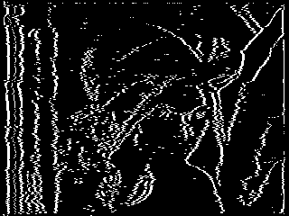
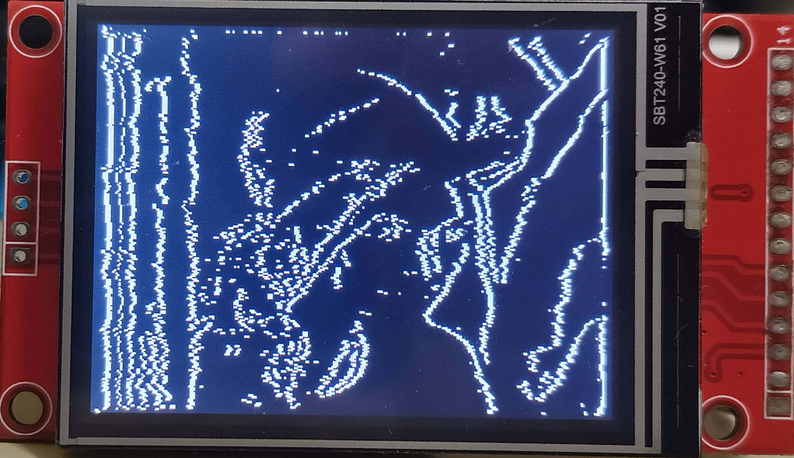
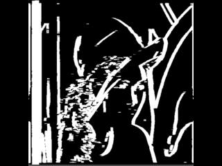
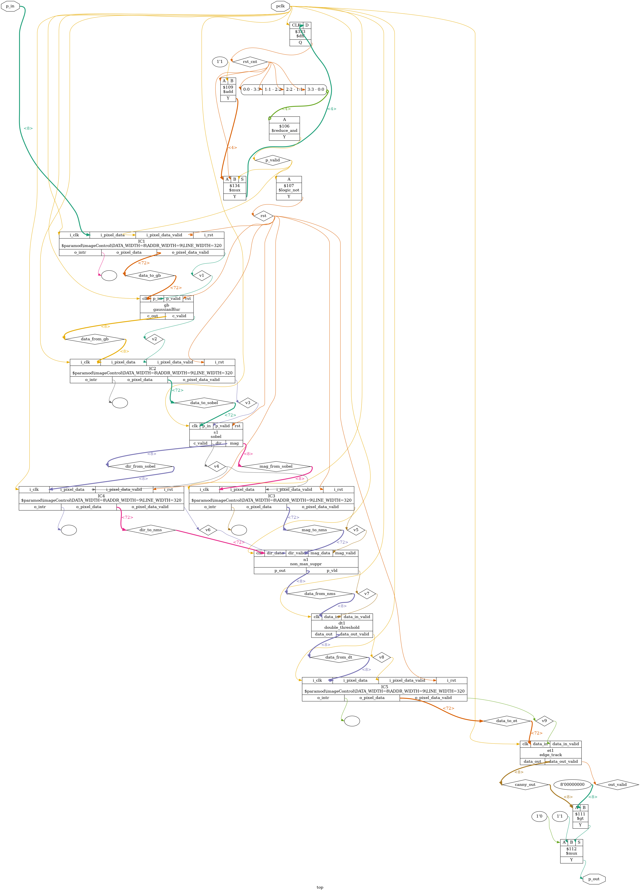

# Canny Edge Detection on Soan Papdi

Full Canny edge detector running live on the SOAN PAPDI (iCE40 UP5K) board.  
An RP2040 streams a test image over a simple parallel bus, the FPGA processes every pixel through a continuous pipeline, and the edges come back out one bit per clock. The result is shown live on an ST7789 display.

No VGA, no framebuffer, no camera module — just a binary file in, edges out.

## What is Canny Edge Detection?

Canny is one of the most widely used edge detection algorithms. It was designed to find edges reliably while keeping noise low and producing thin, well-localized lines. The classic version works in five steps: blur the image to reduce noise, compute the gradient to find edge strength and direction, thin the edges with non-maximum suppression, apply two thresholds to separate strong and weak edges, and finally use hysteresis to keep only the weak edges that connect to strong ones.

On a normal CPU this is usually done as five separate passes over a full image stored in memory. On an FPGA we can turn the same five steps into a continuous pipeline — each stage processes a pixel as soon as it arrives and immediately passes the result to the next stage. 

## Why do this on an FPGA?

Software Canny usually does five full passes over an image sitting in memory: blur → gradient → non-max suppression → double threshold → hysteresis.  

On hardware you don’t need the whole frame at once. Each stage can work on a pixel the moment it arrives and hand the result straight to the next stage. The entire algorithm becomes a continuous pipeline: a pixel goes in one end of the chip and a few clocks later an edge/no-edge decision comes out the other end.

## System Architecture

```
       PC ---resize+grayscale---> RP2040 (streams pixels, 8-bit parallel bus)
                                       |
                                       v
                          +--------------------------+
                          |        iCE40 UP5K        |
                          |                          |
                          |      Gaussian Blur       |
                          |            |             |
                          |            v             |
                          |      Sobel Gradient      |
                          |            |             |
                          |            v             |
                          |   Non-Max Suppression    |
                          |            |             |
                          |            v             |
                          |     Double Threshold     |
                          |            |             |
                          |            v             |
                          |        Edge Track        |
                          +--------------------------+
                                      |
                               1-bit result line
                                      |
                                      v
                              RP2040 (packs bits)
                                      |
                          +-----------------------+
                          |                       |
                          v                       v
                   output_edge.bin         ST7789 Display
```

## Pipeline Stages

1. **Gaussian Blur** — 3×3 kernel to reduce noise before edge detection  
2. **Sobel Gradient** — Finds edge strength and direction  
3. **Non-Maximum Suppression** — Thins thick ridges down to single-pixel lines  
4. **Double Threshold** — Classifies pixels as strong, weak, or background  
5. **Hysteresis** — Keeps weak edges only if they connect to strong ones  

Everything runs as a continuous stream of pixels. No full frame is ever stored inside the FPGA.

## Files

- `top.v` — Top-level module (parameterized for 320×240). 
- `imageControl.v` — Line-buffer + window generato
- `gaussianBlur.v` — 3×3 Gaussian blur stage.
- `sobel.v` — Sobel gradient (magnitude + direction).
- `non_max_suppr.v` — Non-maximum suppression.
- `double_threshold.v` — Double thresholding (strong / weak / background).
- `edge_track.v` — Hysteresis edge tracking.
- `canny.ino` — RP2040 firmware (streams `input.bin`, collects the edge bitstream, drives the ST7789).
- `pin.pcf` — Pin constraints for the SOAN PAPDI board.
## Results

| Input (320×240 grayscale) | FPGA Output (clean edges) | Live on ST7789 |
|---------------------------|---------------------------|----------------|
|  |  |  |


### Before vs After the direction fix

| Thick edges (shift approximation) | Clean edges (exact direction math) |
|-----------------------------------|------------------------------------|
|  |  |

## Resource Usage (iCE40 UP5K)

| Resource       | Used  | Available | % Used |
|----------------|-------|-----------|--------|
| LUTs           | 1633  | 5280      | 30%    |
| Block RAM      | 9     | 30        | 30%    |
| DSP blocks     | 2     | 8         | 25%    |
| I/O pins       | 10    | 96        | 10%    |
| Max frequency  | 48.14 MHz |         |        |

## Pinout

### FPGA (ICE40 UP5K) ↔ RP2040

| Signal   | RP2040 GPIO | Direction     |
|----------|-------------|---------------|
| pclk     | 28          | RP2040 → FPGA |
| p_in[0]  | 27          | RP2040 → FPGA |
| p_in[1]  | 26          | RP2040 → FPGA |
| p_in[2]  | 25          | RP2040 → FPGA |
| p_in[3]  | 23          | RP2040 → FPGA |
| p_in[4]  | 13          | RP2040 → FPGA |
| p_in[5]  | 21          | RP2040 → FPGA |
| p_in[6]  | 20          | RP2040 → FPGA |
| p_in[7]  | 19          | RP2040 → FPGA |
| p_out    | 18          | FPGA → RP2040 |

### ST7789 Display (SPI1) ↔ RP2040

| Signal   | RP2040 GPIO |
|----------|-------------|
| LCD_SCK  | 10          |
| LCD_MOSI | 11          |
| LCD_CS   | 9           |
| LCD_DC   | 8           |
| LCD_RST  | 16          |
| LCD_BL   | 17          |


## Canny Netlist

