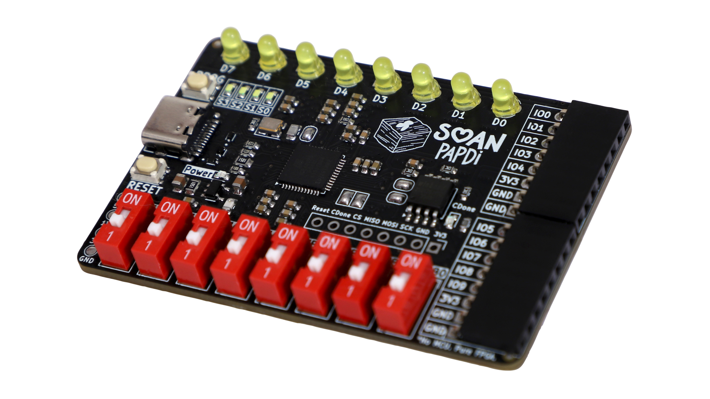

# Soan Papdi Examples

Welcome to the official collection of example projects for Soan Papdi, a beginner-friendly FPGA development board built around the Lattice iCE40UP5K.

The goal of this project is to make learning FPGAs simple and approachable using open-source tools, USB-C connectivity, and support for both Verilog and visual block-based programming.

This repository contains example designs demonstrating the board's onboard peripherals and common FPGA concepts. Whether you're blinking an LED, interfacing with external hardware, or exploring digital design, these examples are intended to help you get started quickly.

**Crowd Supply pre-launch page:** \
https://www.crowdsupply.com/ashoktinkeringlabs/soan-papdi 

**Project website:** \
https://www.ashoktinkeringlabs.com/soan-papdi
